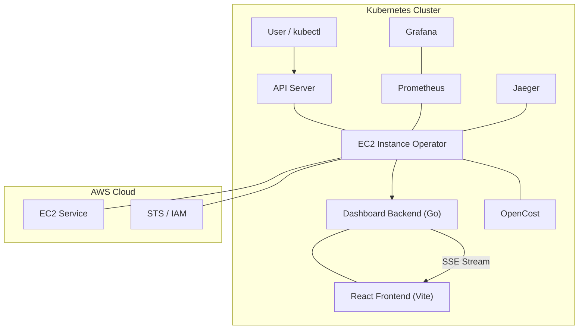

# System Architecture

## Overview
The EC2 Instance Operator is built on the **Operator Pattern**, extending the Kubernetes API to manage external AWS infrastructure. The system is designed for high availability, real-time observability, and developer-centric visualization.

## Architecture Diagram (Logical)

## Data Flow
1. **Creation**: User applies `Ec2Instance` CRD ➔ K8s API Server ➔ Operator Reconciler ➔ AWS SDK `RunInstances`.
2. **Reconciliation**: Operator polls AWS EC2 API every 30s ➔ Detects drift (e.g., manual stop) ➔ Updates K8s Status.
3. **Visualization**: Dashboard Backend watches K8s API ➔ Streams change events via SSE ➔ Frontend reactively updates `InstanceCard`.
4. **Observability**: Operator exports Prometheus metrics ➔ Grafana visualizes ➔ Jaeger tracks AWS call latency.

## Key Design Decisions
- **Embedded Dashboard**: Zero-dependency deployment by embedding the React SPA into the Go binary.
- **Glassmorphism UI**: Uses a premium, dark-themed design system with backdrop blurs and subtle gradients.
- **SSE Over WebSockets**: Simplifies real-time updates without the overhead of full-duplex communication.
- **OpenTelemetry Standard**: Ensures vendor-neutral tracing and metrics compatibility.
