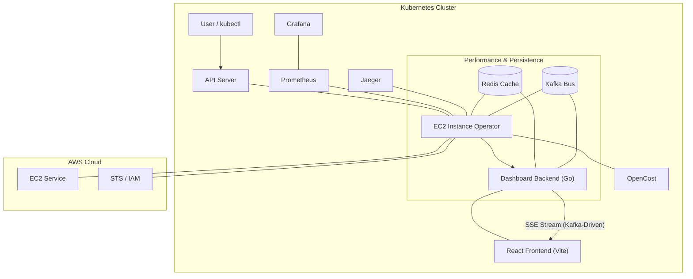

# System Architecture

## Overview
The EC2 Instance Operator is built on the **Operator Pattern**, extending the Kubernetes API to manage external AWS infrastructure. The system is designed for high availability, real-time observability, and developer-centric visualization.

## Architecture Diagram (Logical)

```mermaid
graph TD
    subgraph "Kubernetes Cluster"
        A["User / kubectl"] --> B["API Server"]
        B --- C["EC2 Instance Operator"]
        C --> D["Dashboard Backend (Go)"]
        D --- E["React Frontend (Vite)"]
        F["Prometheus"] --- C
        G["Grafana"] --- F
        H["Jaeger"] --- C
        C --- I["OpenCost"]
        
        subgraph "Performance & Persistence"
            R[("Redis Cache")] --- C
            K[("Kafka Bus")] --- C
            R --- D
            K --- D
        end
    end
    
    subgraph "AWS Cloud"
        C --- J["EC2 Service"]
        C --- L["STS / IAM"]
    end

    D -- "SSE Stream (Kafka-Driven)" --> E
```

## Performance Architecture
To support high-scale operations (1,000+ instances), the operator incorporates a specialized performance layer:
- **Redis Cache**: Caches AWS instance state and dashboard statistics. Reduces AWS API calls during reconciliation and metadata lookups.
- **Kafka Event Bus**: Decouples the reconciliation loop from the dashboard API. Enables a real-time, event-driven update model for the UI via SSE.
- **AWS Client Pooling**: Reuses EC2 service clients per region to eliminate redundant SDK initialization overhead.

For more details, see [Performance Optimization Guide](PERFORMANCE_OPTIMIZATION.md).

## Data Flow
1. **Creation**: User applies `Ec2Instance` CRD ➔ K8s API Server ➔ Operator Reconciler ➔ AWS SDK `RunInstances`.
2. **Reconciliation**: Operator checks **Redis Cache** first ➔ Falls back to AWS EC2 API every 30s ➔ Detects drift ➔ Updates K8s Status ➔ Publishes change to **Kafka**.
3. **Visualization**: Dashboard Backend consumes **Kafka events** ➔ Streams change events via SSE ➔ Frontend reactively updates `InstanceCard`.
4. **Observability**: Operator exports Prometheus metrics ➔ Grafana visualizes (including cache hit/miss rates) ➔ Jaeger tracks AWS call latency.

## Key Design Decisions
- **Embedded Dashboard**: Zero-dependency deployment by embedding the React SPA into the Go binary.
- **Glassmorphism UI**: Uses a premium, dark-themed design system with backdrop blurs and subtle gradients.
- **SSE Over WebSockets**: Simplifies real-time updates without the overhead of full-duplex communication.
- **OpenTelemetry Standard**: Ensures vendor-neutral tracing and metrics compatibility.
