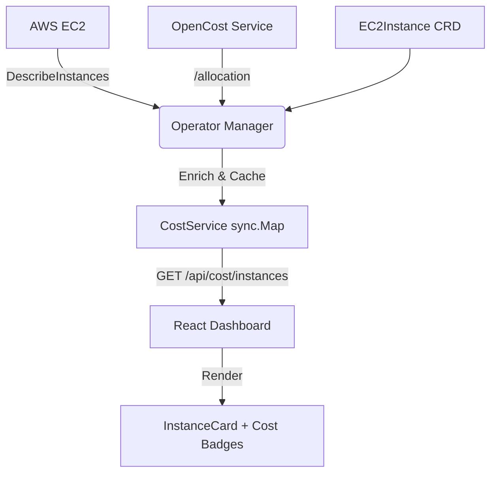

 # EC2 Instance Cost Architecture

## Overview
The EC2 Operator provides real-time cost visibility for managed resources by combining data from **OpenCost** (for cluster-resident nodes) and **AWS EC2 Pricing** (for on-demand instances). This document explains the data pipeline from the AWS Cloud to the Dashboard UI.

## Data Pipeline Flow

## How Cost is Computed

### 1. Identify Target Instances
The `CostService` (running as a background worker in the Manager) lists all Kubernetes **Nodes** and all **Ec2Instance** Custom Resources.
- **Nodes**: Identifies EC2 `instanceId` and `region` from the `spec.providerID` (e.g., `aws:///us-east-1/i-0123abcd`).
- **CRDs**: Identifies instances created by the operator that might not have joined the cluster yet.

### 2. Fetch OpenCost Allocation
The Manager calls the OpenCost API:
`GET http://opencost.opencost.svc.cluster.local:9003/allocation?aggregate=node&window=1d`
- **Mapping**: Matches the K8s `nodeName` to the OpenCost `node` field to retrieve the actual `totalCost` for that physical machine.

### 3. AWS Status Enrichment
Simultaneously, the Manager uses the **AWS SDK for Go v2** to call `DescribeInstances` for all identified IDs. This retrieves:
- **Instance Type** (e.g., `t3.micro`)
- **Current State** (e.g., `running`, `stopped`)
- **Placement Region**

### 4. Pricing Calculation & Fallback
To ensure a seamless user experience even if OpenCost is temporarily unavailable or a node is newly joined, the Operator implements a **dual-source strategy**:
- **Primary (OpenCost)**: Accurate real-world cost for nodes already in the cluster.
- **Secondary (Static Fallback)**: If OpenCost returns 0, the Operator uses an internal **On-Demand Pricing Table** (located in `internal/dashboard/cost_service.go`). This table maps common EC2 instance types (t3.micro, m5.large, etc.) to their hourly Linux rates.

**Formula**:
- **Daily Cost**: `totalCost` (OpenCost) OR `hourlyRate * 24` (Fallback).
- **Monthly Cost**: `DailyCost * 30`.

## API Interactions

1. **Manager Internal**: Periodically syncs data every 60 seconds.
2. **Dashboard Backend**: Exposes endpoints via `handleListCosts` and `handleGetCost`.
   - `GET /api/cost/instances`: Returns a JSON array of all tracked costs.
3. **Frontend Dashboard**:
   - `useAllCosts()` hook: Fetches the list periodically using the `fetchAllCosts` API client.
   - `InstanceCard` component: Displays the `monthlyCost` badge with a "Powered by OpenCost" tooltip.
   - **Aggregate View**: Sums up all `monthlyCost` values to show the "Est. Monthly Cost" in the main dashboard header.

## Cost Accuracy Note
Since many managed instances are `t3` or `t2` burstable types, the fallback pricing provides a highly accurate baseline, while OpenCost captures variances like storage costs and network egress where applicable.
