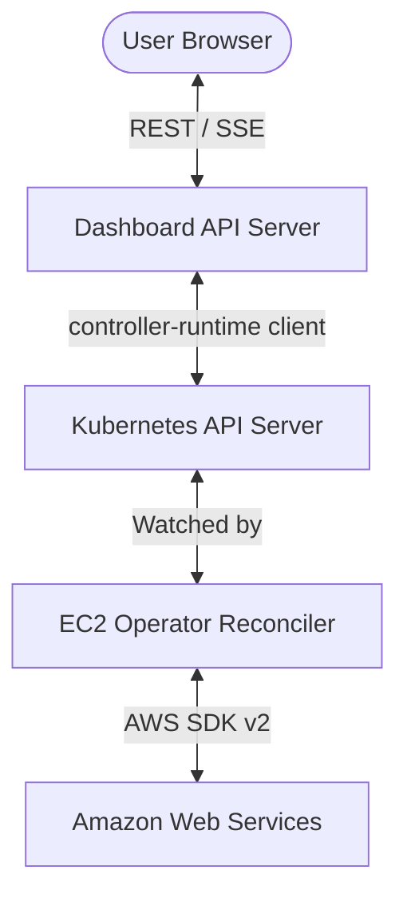

# Web UI Architecture

The EC2 Instance Operator Dashboard is a real-time, event-driven web application built with modern web technologies and a focus on observability.

## 🏗 System Architecture

The dashboard operates as an embedded component within the EC2 Kubernetes Operator.

### 📡 Data Flow & State Updates

The dashboard uses **Server-Sent Events (SSE)** to provide real-time updates to the UI without requiring page refreshes.

1.  **Initial Load**: When the dashboard loads, it performs a standard `GET /api/instances` call to populate the initial list.
2.  **Streaming Updates**: The frontend opens a persistent connection to `/api/instances/watch`.
3.  **Polling Loop**: The backend dashboard server runs a background loop (every 2 seconds) that queries the Kubernetes API for the current state of `Ec2Instance` resources.
4.  **Differential Updates**: The server compares the current state with the last known state for each client and sends `ADDED`, `MODIFIED`, or `DELETED` events over the SSE stream.
5.  **Reactive UI**: The React frontend listens for these events and updates the local state, triggering smooth re-renders.

### 🔌 API Endpoints (Backend -> Operator)

The dashboard server interacts with the Kubernetes API server using the `controller-runtime` client:
-   `GET /api/instances`: Lists all `Ec2Instance` custom resources.
-   `GET /api/instances/{name}`: Fetches a single instance's detailed specification and status.
-   `GET /api/instances/{name}/events`: (Coming Soon) Fetches Kubernetes events related to the specific instance.
-   `GET /api/stats`: Aggregates metrics from the operator's internal Prometheus counters.
-   `GET/POST /api/settings`: Manages user personalization settings stored in a cluster-wide ConfigMap.

## 🛠 Tech Stack

-   **Frontend**: React, TypeScript, Vite, Tailwind CSS, Lucide Icons, Framer Motion.
-   **Backend**: Go (standard `net/http` server embedded in the operator).
-   **Observability**: Integrated with Prometheus (metrics), Jaeger (tracing), and OpenCost (cloud cost monitoring).

## 🚀 Development

The frontend is a standalone React app located in the `web/` directory. For local development:
1.  Run the operator locally (`make run`) to start the API server.
2.  Navigate to the `web/` directory.
3.  Run `npm install && npm run dev`.
4.  The dashboard will connect to the local operator at `http://localhost:3000/api`.
